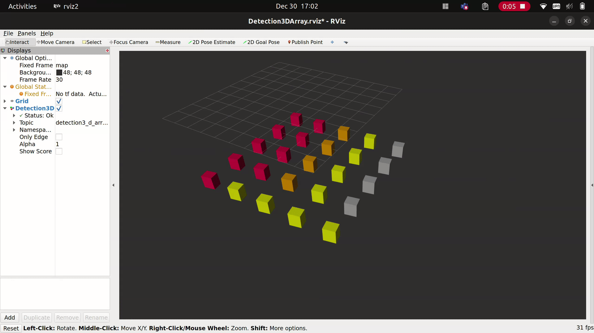

# vision_msgs_rviz_plugins

This repo contains a RVIZ2 plugin to display [vision_msgs](https://github.com/ros-perception/vision_msgs/tree/ros2) for ROS 2 humble.

- [x] Detection3DArray
  - [x] Display ObjectHypothesisWithPose/score
  - [x] Change color based on ObjectHypothesisWithPose/id [car: orange, person: blue, cyclist: yellow, motorcycle: purple, other: grey]
  - [x] Visualization propperties
    - [x] Alpha
    - [x] Line or Box
    - [x] Linewidth
    - [x] Change color map based on provided yaml file
- [x] Detection3D
  - [x] Display ObjectHypothesisWithPose/score
  - [x] Change color based on ObjectHypothesisWithPose/id [car: orange, person: blue, cyclist: yellow, motorcycle: purple, other: grey]
  - [x] Visualization propperties
    - [x] Alpha
    - [x] Line or Box
    - [x] Linewidth
    - [x] Change color map based on provided yaml file
- [x] BoundingBox3D
    - [x] Alpha
    - [x] Line or Box    
        <span style="color:red">**Since no header in vision_msgs/BonudingBox visualizations uses rviz fixed frame for tf transformation**</span>
    - [x] Linewidth
- [x] BoundingBox3DArray
    - [x] Alpha
    - [x] Line or Box
    - [x] Linewidth



## Install and Testing

__Install:__
1. Via apt:
```bash
sudo apt update && sudo apt install ros-$ROS_DISTRO-vision-msgs-rviz-plugins
```

2. From source:
```bash
$ cd ros2_ws/src && git clone https://github.com/NovoG93/vision_msgs_rviz_plugins -b humble
$ cd ros2_ws && rosdep install --from src --ignore-src -r -y \
  && colcon build --symlink-install --packages-select vision_msgs_rviz_plugins
```

__Testing:__
```bash
$ ros2 launch vision_msgs_rviz_plugins test_all.launch.py 
```